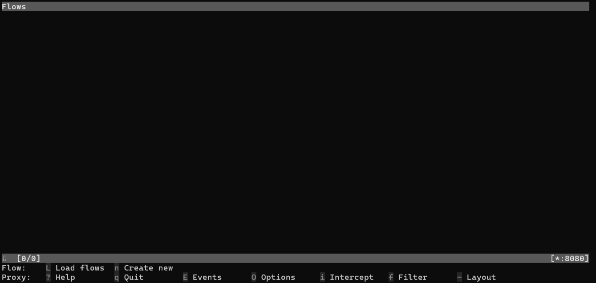
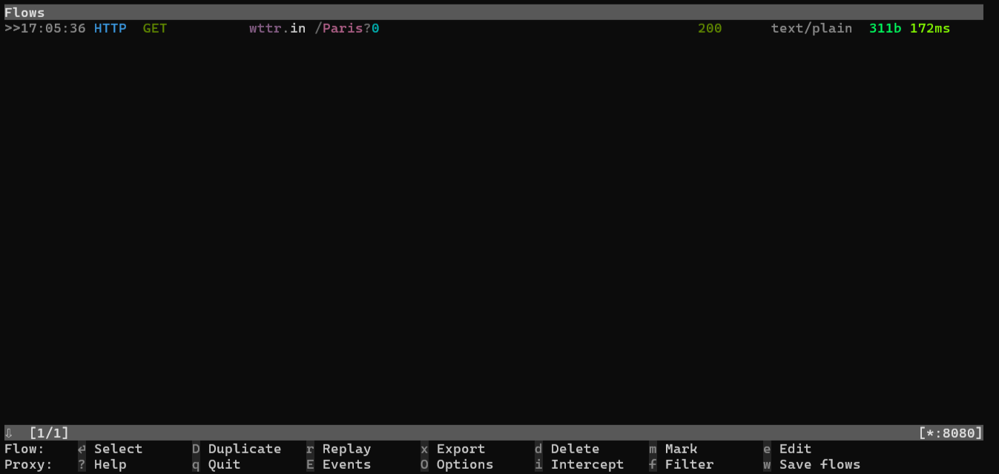
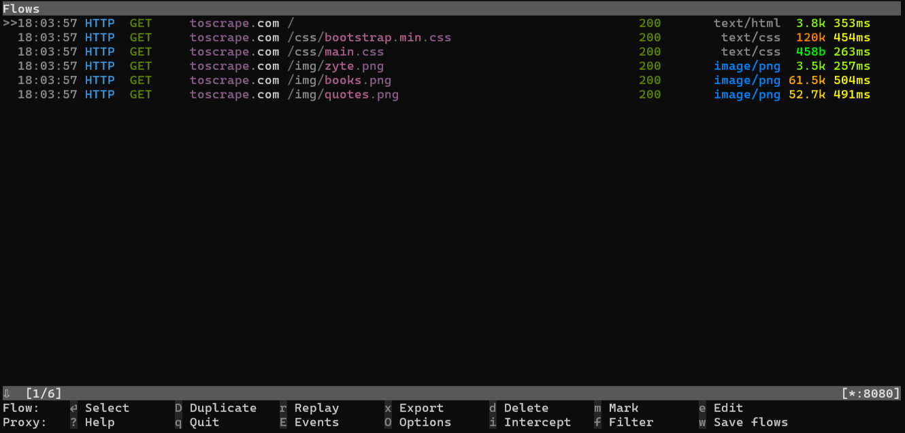

[](https://brightdata.com/?promo=github15) 

# How to Use Proxy Servers in Node.js
Learn how to integrate a proxy into `node-fetch`, Playwright, and Puppeteer. You'll also see how to use Bright Data' [residential proxies](https://brightdata.com/proxy-types/residential-proxies) in Axios. The guide is also available on the [Bright Data blog](https://brightdata.com/blog/how-tos/nodejs-proxy-servers).

- [Requirements](#requirements)
  * [Set Up a Local Proxy Server](#set-up-a-local-proxy-server)
- [Integrating Proxies in Node.js](#integrating-proxies-in-nodejs)
  * [Local Proxy Integration With `node-fetch`](#local-proxy-integration-with-node-fetch)
  * [Local Proxy Integration in Playwright](#local-proxy-integration-in-playwright)
  * [Local Proxy Integration Using Puppeteer](#local-proxy-integration-using-puppeteer)
- [Bright Data Proxy Integration in Node.js](#bright-data-proxy-integration-in-nodejs)
  * [Residential Proxy Configuration](#residential-proxy-configuration)
  * [Axios Proxy Setup](#axios-proxy-setup)
  * [Testing IP Rotation](#testing-ip-rotation)

## Requirenments
Make sure you have Node.js installed on your machine. Otherwise, download the installer from the [official site](https://nodejs.org/en/download), launch it, and follow the installation wizard.

Create a folder for your Node.js project, enter it, and initialize an npm application inside it:
```bash
mkdir <NODE_PROJECT_FOLDER_NAME>
cd <NODE_PROJECT_FOLDER_NAME>
npm init -y
```

### Set Up a Local Proxy Server
[mitmproxy](https://mitmproxy.org/) is an open-source interactive HTTPS proxy. Use it to set up a local proxy server.

Install mitmproxy by following the [installation guide for your OS](https://docs.mitmproxy.org/stable/overview-installation/) and launch it:
```bash
mitmproxy
```
The following interface will show up:


You now have a local proxy server listening locally on port `8080`. Verify that with this command:

```
curl --proxy http://localhost:8080 "http://wttr.in/Paris?0"
```
**Note**: On Windows, use `curl.exe` instead of `curl`.

The result should be something like:
```
Weather report: Paris

                Overcast
       .--.     -2(-6) °C
    .-(    ).   ↙ 11 km/h
   (___.__)__)  10 km
                0.0 mm
```

Go back to the mitmproxy interface, and see that it intercepted the request:


## Integrating Proxies in Node.js
Write a Node.js script to connect to a site via the local proxy server using the following technologies:
* [`node-fetch`](https://www.npmjs.com/package/node-fetch)
* [Playwright](https://playwaright.dev/)
* [Puppeteer](https://pptr.dev/)

### Local Proxy Integration With `node-fetch`
You need the `http-proxy-agent` library to configure a proxy in `node-fetch`.

Install them both with:
```bash
npm install node-fetch http-proxy-agent
```
**Note**: `node-fetch` v3.x is an ESM-only module. Set `"type"="module"` in your `package.json` to make it work.

Use the `fetch()` method to send requests through your proxy server:
```javascript
// node-fetch-proxy.js

import fetch from "node-fetch";
import { HttpProxyAgent } from "http-proxy-agent";

async function fetchData(url) {
  try {
    // initialize the local proxy agent
    const proxyAgent = new HttpProxyAgent(
      "http://localhost:8080"
    );
    // connect to the target site through the
    // local proxy
    const response = await fetch(url, {
      agent: proxyAgent,
    });

    // retrieve the HTML returned by the
    // server and print it
    const data = await response.text();
    console.log(data);
  } catch (error) {
    console.error("Error fetching data:", error);
  }
}

fetchData("http://toscrape.com/");
```

### Local Proxy Integration in Playwright
Add Playwright to your project's dependencies:
```bash
npm install playwright
```

Finalize the Playwright installation with:
```bash
npx playwright install --with-deps
```
**Note**: This will take a while as it'll also install the browser binaries and their dependencies.

Create a `playwright-proxy.js` file and integrate a proxy into Playwright:
```javascript
// playwright-proxy.js

import { chromium } from "playwright";

(async () => {
  // create a Chromium instance with
  // the local proxy configuration
  const browser = await chromium.launch({
    proxy: {
      server: "http://localhost:8080",
    },
  });

  // add a new tab and connect to the
  // target page
  const page = await browser.newPage();
  await page.goto("http://toscrape.com/");

  // extract the HTML content of the page
  // and log it
  const content = await page.content();
  console.log(content);

  // release the browser resources
  await browser.close();
})();
```

### Local Proxy Integration Using Puppeteer
Install Puppeteer:
```bash
npm install puppeteer
```

Integrate the local proxy into Puppeteer as in the `puppeteer-proxy.js` script:
```javascript
// puppeteer-proxy.js

import puppeteer from "puppeteer";

(async () => {
    // pass the URL of the local proxy to
    // the `--proxy-server` flag to configure it in Chrome
    const browser = await puppeteer.launch({
        args: ["--proxy-server=http://localhost:8080"]
    });

    // open a new page and visit the target site
    const page = await browser.newPage();
    await page.goto("http://toscrape.com/");

    // retrieve the HTML content of the page
    // and log it
    const content = await page.content();
    console.log(content);

    // release the browse recources
    await browser.close();
})();
```

## Testing Proxy Integration in Node.js
Launch the Node.js proxy integration scripts with:
```bash
node <NODE_SCRIPT_NAME>
```

They'll print the following HTML:
```html
<!DOCTYPE html>
<html lang="en">
    <head>
        <meta http-equiv="Content-Type" content="text/html; charset=UTF-8">
        <title>Scraping Sandbox</title>
        <link href="./css/bootstrap.min.css" rel="stylesheet">
        <link href="./css/main.css" rel="stylesheet">
    </head>
    <body>
    <!-- omitted for brevity ... -->
```

The mitmproxy interface will log all the requests made by the script. With `node-fetch`, it'll be only the GET request to `http://toscrape.com/`. With Playwright and Puppeteer, it'll also include the requests the browser makes for loading the JS and CSS files of the page:


## Bright Data Proxy Integration in Node.js
Bright Data provides [premium proxies](https://brightdata.com/proxy-types) that automatically rotate the exit IP for you. Let's see how to integrate them with Axios in a Node.js script.

### Residential Proxy Configuration
[Sign up for Bright Data](https://brightdata.com/cp/start) to start a free trial. Navigate to the "Proxies & Scraping Infrastructure" dashboard and configure a new residential proxy.

Retrieve the following credentials:
* `<BRIGHTDATA_PROXY_HOST>`
* `<BRIGHTDATA_PROXY_PORT>`
* `<BRIGHTDATA_PROXY_USERNAME>`
* `<BRIGHTDATA_PROXY_PASSWORD>`

### Axios Proxy Setup
Install Axios:
```bash
npm install axios
```

Integrate a Bright Data residential proxies into Axios as in the `axios-proxy.js` script below:
```javascript
import axios from "axios";

async function fetchDataWithBrightData(url) {
    // configuration to instruct Axios
    // to route the traffic through the specified proxy
    const proxyOptions = {
        proxy: {
            host: "<BRIGHTDATA_PROXY_HOST>",
            port: "<BRIGHTDATA_PROXY_PORT>",
            auth: {
                username: "<BRIGHTDATA_PROXY_USERNAME>",
                password: "<BRIGHTDATA_PROXY_PASSWORD>"
            }
        }
    };


    try {
        // connect to the target page
        // and log the server response
        const response = await axios.get(url, proxyOptions);
        console.log(response.data);
    } catch (error) {
        console.error('Error:', error);
    }
}

fetchDataWithBrightData("http://lumtest.com/myip.json");
```

### Testing IP Rotation
Run the Axios proxy integration script with:
```
node axios-proxy.js
```

`http://lumtest.com/myip.json` is a special endpoint that returns information about your IP.

Execute the script several times and you'll see different IPs from different locations each time.
